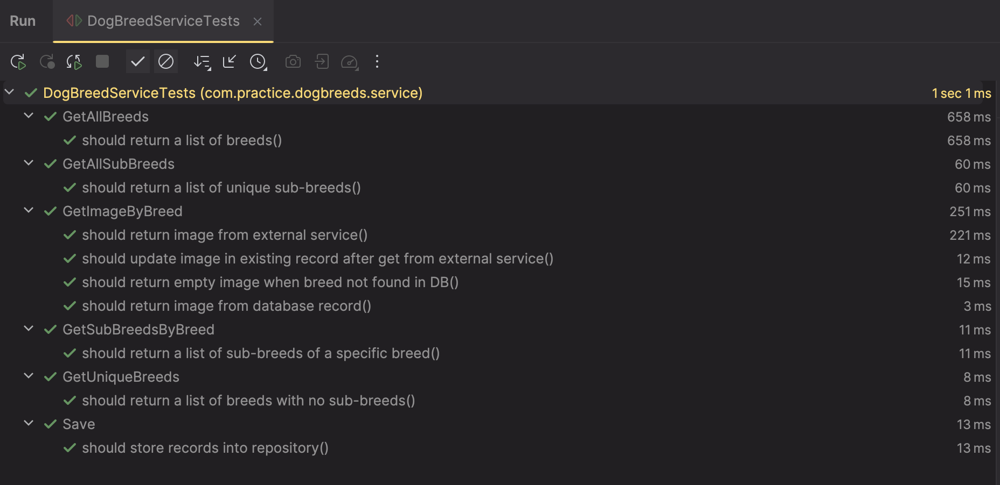
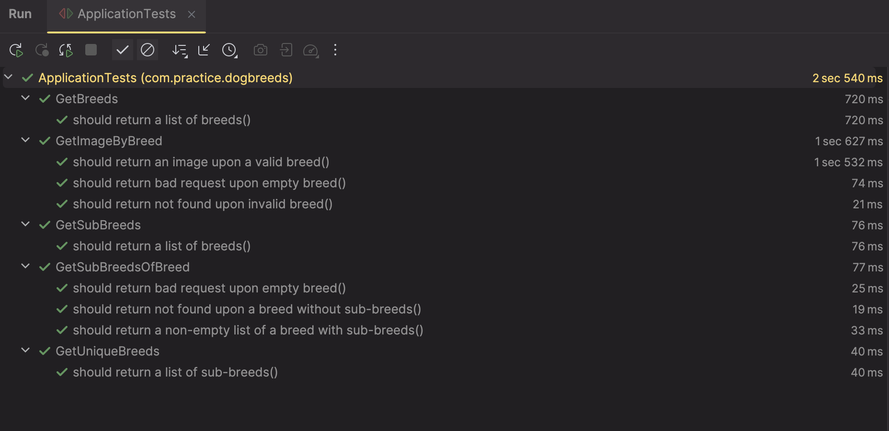
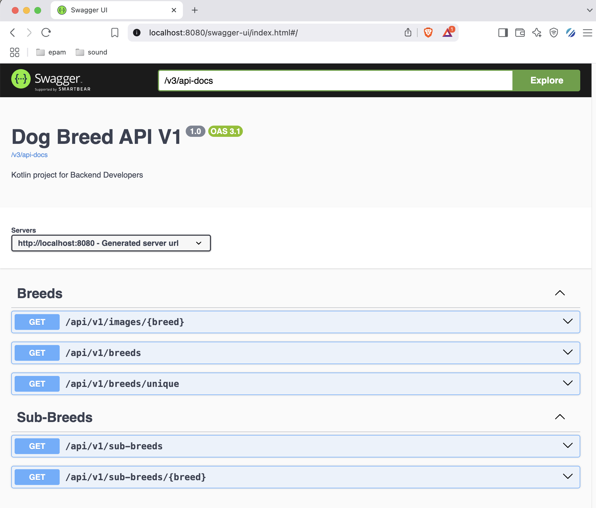

# kotlin-dog-breeds

## Table of Contents

1. [Overview](#1-overview)
2. [Commands](#2-commands)
3. [Endpoints](#3-endpoints)
4. [The Task](#4-the-task)
   1. [Kotlin Code](#41-kotlin-code)
   2. [Controllers](#42-controllers)
   3. [Exception Handling](#43-exception-handling)
   4. [Testing](#44-testing)
   5. [Swagger Integration](#45-swagger-integration)
   6. [Pull Request](#46-pull-request-)
5. [Tools](#5-tools)
6. [References](#6-references)
7. [Guides](#7-guides)

## 1. Overview

This a template service for Kotlin for Backend Developers mentoring program. It's a Java based template and has to be migrated into kotlin and later updated according to the task. The service uses [Dog CEO](https://dog.ceo/dog-api/) public API to obtain information about various dog breeds.

## 2. Commands

```
ktlint --format
./mvnw clean compile
```

## 3. Endpoints

### 3.1. API

- http://localhost:8080/api/v1/breeds
- http://localhost:8080/api/v1/breeds/unique
- http://localhost:8080/api/v1/images/{breed}
- http://localhost:8080/api/v1/sub-breeds
- http://localhost:8080/api/v1/sub-breeds/{breed}

#### 3.2. Helpers

- http://localhost:8080/
- http://localhost:8080/v2/breeds
- http://localhost:8080/actuator
- http://localhost:8080/actuator/prometheus

## 4. The Task

### 4.1. Kotlin Code

Migrate existing Java code into Kotlin

- [x] You can use the build tool of your choice and the database of your choice.
- [x] Your mentor should be able to run the service without additional preparations on his/her end. 
- [x] On the start of the service the data is loaded from https://dog.ceo/api/breeds/list/all into the database. If the data already in db, this step is skipped.
- [x] Use Spring WebClient to make a REST call to the api.
- [x] Use Spring Data R2DBC to store the data into the database.
- [x] Remove all unnecessary dependencies after the migration.
- [x] You MUST use **coroutines** everywhere. 
- [x] **Flux and Mono are not allowed**.
- [x] Try out `CoroutineCrudRepository` instead of `CrudRepository`.

### 4.2. Controllers

- [x] Add controllers or router functions (if you want to go functional way).
- [x] Endpoint/router function that returns list of all breeds retrieved from db.
  - [x] This endpoint is already defined in the template. You need to migrate it into kotlin.
  - [x] Make sure caching still works in a new version. You can check cache hits in [Prometheus Metrics](http://localhost:8080/actuator/prometheus).
- [x] Endpoint/router function that will retrieve all sub-breeds.
- [x] Endpoint/router function that will retrieve breeds that don't have sub-breeds.
- [x] Endpoint/router function that will retrieve sub-breeds of the specified breed.
- [x] Endpoint/router function that will retrieve image of the specified breed, store it in db and return back to the user.
  - [x] To obtain the image, call https://dog.ceo/api/breed/{BREED_TYPE}/images.
  - [x] If there is already an image in db, just return it, if not call the mentioned api to obtain it.
- [x] You MUST use **coroutines** everywhere. **Flux and Mono are not allowed**!<br />
- [x] Try out CoroutineCrudRepository instead of CrudRepository

### 4.3. Exception Handling

- [x] Handle cases like 400, 404, 500, failed calls to the api, etc. 
  - Preferably at a global level: https://www.baeldung.com/spring-webflux-errors#global

### 4.4. Testing

- [x] Add unit test for service layer using MockK framework and JUnit 5.
- [x] Add integration tests for controller layer.

### 4.4.1. Unit Tests



### 4.4.2. Integration Tests



### 4.4.3. Swagger Tests



### 4.5. Swagger Integration

- [x] Make sure your endpoints work via Swagger.

### 4.6. Pull Request 

- [x] Create a pull request and assign your mentor as a reviewer.

## 5. Tools

* [Swagger](http://localhost:8080/swagger-ui/index.html)
* [Prometheus metrics](http://localhost:8080/actuator/prometheus)

## 6. References

For further reference, please consider the following sections:

* [Spring WebFlux](https://docs.spring.io/spring-framework/docs/current/reference/html/web-reactive.html)
* [Spring WebClient with Kotlin extensions](https://www.baeldung.com/kotlin/spring-boot-kotlin-coroutines)
* [Spring Data R2DBC](https://docs.spring.io/spring-data/r2dbc/docs/current/reference/html/)
* [Spring and Kotlin](https://docs.spring.io/spring-framework/docs/current/reference/html/languages.html#languages)
* [Spring cache abstraction](https://docs.spring.io/spring-boot/docs/3.0.6/reference/htmlsingle/#io.caching)
* [Spring Data JPA](https://docs.spring.io/spring-boot/docs/3.0.6/reference/htmlsingle/#data.sql.jpa-and-spring-data) 
* [Junit 5, Spring Boot Test](https://docs.spring.io/spring-boot/docs/2.0.x/reference/html/boot-features-testing.html)
* [Kotlin](https://spring.io/guides/tutorials/spring-boot-kotlin/) 
* [Kotlin Coroutines](https://kotlinlang.org/docs/coroutines-overview.html) 
* [MockK](https://mockk.io/) 
* [Swagger](https://swagger.io/)

## 7. Guides

The following guides illustrate how to use some features concretely:

* [Kotlin Coroutines](https://www.baeldung.com/kotlin/coroutines)
* [Spring Webflux and Kotlin](https://www.baeldung.com/kotlin/spring-boot-kotlin-coroutines)
* [Going Reactive with Spring, Coroutines and Kotlin Flow](https://spring.io/blog/2019/04/12/going-reactive-with-spring-coroutines-and-kotlin-flow)
* [Router Functions in Spring WebFlux](https://blog.knoldus.com/router-function-in-spring-webflux/)
* [Spring Functional Web](https://www.baeldung.com/spring-5-functional-web)
* [Spring Reactive Sample](https://hantsy.github.io/spring-reactive-sample/web/func.html)
* [MockK](https://www.baeldung.com/kotlin/mockk)